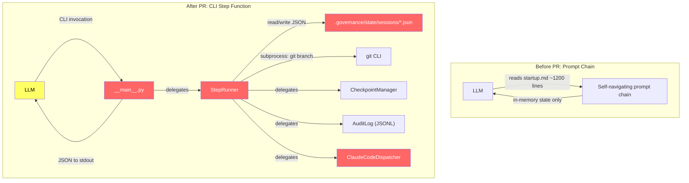
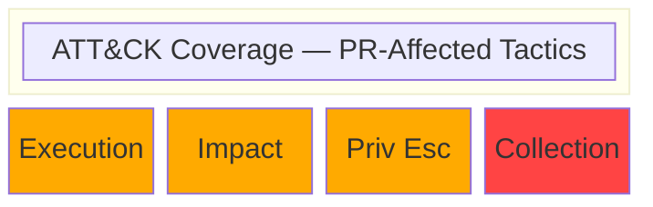
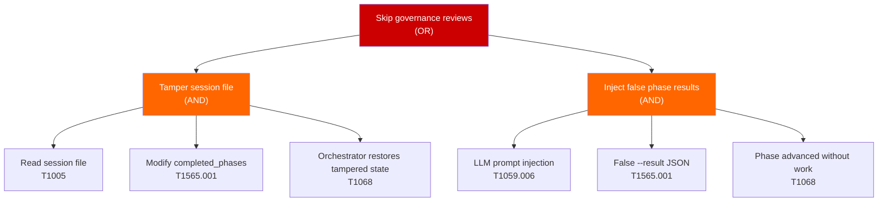
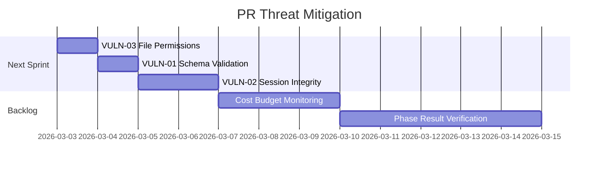

# Threat Model — Retire Prompt Chaining: Orchestrator CLI as Sole Control Plane

**Panel:** threat-modeling v1.0.0
**Date:** 2026-03-02T17:00:00Z
**Policy Profile:** default
**Repository:** convergent-systems-co/dark-forge
**PR:** #587 (feat/retire-prompt-chaining)
**Triggered by:** manual

---

## 1. Systems Architect: Architecture Presentation

> Scope: Components and data flows affected by this PR only.

### 1.1 Component Inventory (Affected by PR)

| Component | Type | Technology | Change Type | Exposure Impact | Data Sensitivity Impact |
|-----------|------|------------|-------------|-----------------|------------------------|
| `__main__.py` (CLI entry point) | Application | Python/argparse | New | Increased | Unchanged |
| `step_runner.py` (orchestrator core) | Application | Python | New | Increased | Increased |
| `session.py` (SessionStore) | Data Store | Python/JSON files | New | Increased | Increased |
| `step_result.py` (StepResult contract) | Data Model | Python/dataclass | New | Unchanged | Unchanged |
| `claude_code_dispatcher.py` (dispatch instructions) | Application | Python | New | Increased | Unchanged |
| `state_machine.py` (serialization) | Application | Python | Modified | Unchanged | Increased |
| `config.py` (session_dir) | Configuration | Python | Modified | Unchanged | Unchanged |
| `startup.md` (prompt) | Configuration | Markdown | Modified | Unchanged | Unchanged |
| `startup-legacy.md` (legacy prompt) | Configuration | Markdown | New (preservation) | Unchanged | Unchanged |
| `bin/auto-clear.sh` (outer loop) | Shell Script | Bash | New | Increased | Unchanged |

### 1.2 Data Flow Changes

> Yellow = modified, Red = new. Shows only flows affected by this PR.

### 1.3 Trust Boundary Impact

| Boundary ID | Name | Impact | Description |
|-------------|------|--------|-------------|
| TB-01 | LLM ↔ Orchestrator CLI | New | LLM invokes Python CLI via subprocess; CLI returns JSON to stdout. The LLM is untrusted from the orchestrator's perspective — it supplies `--result` JSON and `--complete` phase numbers. |
| TB-02 | Orchestrator ↔ File System (Session State) | New | Session state is written/read as JSON files in `.governance/state/sessions/`. Any process with filesystem access can read or tamper with session state. |
| TB-03 | Orchestrator ↔ git CLI | New | `step_runner.py` calls `git branch --show-current` via `subprocess.run()`. Git output is consumed as branch name metadata. |
| TB-04 | auto-clear.sh ↔ Claude CLI | New | Shell script invokes `claude --prompt` in a retry loop. Exit codes and orchestrator status JSON drive loop decisions. |

### 1.4 New External Dependencies

| Dependency | Type | Data Shared | Introduced By |
|-----------|------|-------------|---------------|
| `argparse` (stdlib) | Python stdlib | CLI arguments | `__main__.py` |
| `subprocess` (stdlib) | Python stdlib | git command execution | `step_runner.py` |
| `uuid` (stdlib) | Python stdlib | Session/task ID generation | `step_runner.py`, `claude_code_dispatcher.py` |

No new third-party dependencies introduced. All imports are from the Python standard library or existing in-repo modules.

### 1.5 Agentic System Specifics

#### OWASP LLM Top 10 — Changes Introduced

| ID | Threat | Affected by PR? | Change Description | Risk Delta |
|----|--------|-----------------|-------------------|------------|
| LLM01 | Prompt Injection | Yes | startup.md reduced from ~1200 to ~130 lines, reducing prompt injection surface in the orchestration prompt. However, the `--result` CLI argument now accepts arbitrary JSON from the LLM, creating a new injection vector at the CLI boundary. | Decreased (prompt surface) / Increased (CLI input) |
| LLM04 | Model Denial of Service | Yes | `auto-clear.sh` implements exponential backoff with a 300s cap, preventing tight restart loops. Session persistence means a corrupted session file could block all future sessions. | Unchanged (backoff mitigates, but new DoS vector via corrupt state) |
| LLM07 | Insecure Plugin Design | Yes | The CLI acts as a "plugin" the LLM calls. Input validation on `--result` is limited to JSON parse checking; semantic validation of phase results is minimal. | Increased |

#### Agent-Specific Impact

| Dimension | Before PR | After PR | Risk Delta |
|-----------|----------|----------|------------|
| State persistence | In-memory only (lost on context reset) | Disk-persisted JSON files | Increased (state tampering surface) |
| Control plane authority | LLM self-navigates via prompt chain | Python CLI holds program counter; LLM follows instructions | Decreased (deterministic control reduces LLM drift) |
| Session continuity | Checkpoint-based (user-facing only) | Dual: session files (internal) + checkpoints (user-facing) | Unchanged |
| Subprocess calls | None from orchestrator | `git branch --show-current` via subprocess | Increased (subprocess injection surface, though mitigated by hardcoded command) |

---

## 2. MITRE Analyst: Trust Boundary Crossings

> Scope: Only trust boundary crossings affected (new, modified, or removed) by this PR.

### Crossing Inventory (PR-Affected)

| Crossing ID | Boundary | Source | Destination | Change Type | Data Types | New/Changed Protections |
|-------------|----------|--------|-------------|-------------|------------|------------------------|
| TBC-01 | TB-01 | LLM | CLI (__main__.py) | New | CLI arguments (--result JSON, --complete int, --session-id string) | JSON parse validation, argparse type enforcement |
| TBC-02 | TB-01 | CLI (__main__.py) | LLM (stdout) | New | JSON response (StepResult) | Structured dataclass serialization |
| TBC-03 | TB-02 | StepRunner | Session files on disk | New | Full orchestrator state (issues, PRs, signals, state machine, circuit breaker) | File path sanitization (slashes replaced) |
| TBC-04 | TB-02 | Session files on disk | StepRunner | New | Persisted session JSON | Dataclass field filtering on load |
| TBC-05 | TB-03 | StepRunner | git subprocess | New | Hardcoded command (`git branch --show-current`) | Timeout (5s), capture_output=True |
| TBC-06 | TB-04 | auto-clear.sh | claude CLI + orchestrator status | New | Exit codes, JSON status output | Exponential backoff, retry cap |

### Per-Crossing Analysis

#### TBC-01: LLM → CLI (--result JSON input)

- **Change description:** The LLM passes arbitrary JSON via `--result` CLI argument when completing a phase. This is parsed by `json.loads()` and absorbed into session state.
- **Data in transit (new/modified):** Arbitrary JSON from the LLM, expected to contain phase-specific keys (issues_selected, plans, dispatched_task_ids, prs_created, etc.)
- **New protections added:** `json.loads()` parse validation with error handling; argparse `--complete` type=int enforcement
- **Remaining gaps:** No schema validation on the `--result` JSON content. The `_absorb_result()` method uses `.get()` with defaults but does not validate types or value ranges. A malicious or confused LLM could inject unexpected keys or oversized values.
- **Applicable ATT&CK techniques:** T1059.006 — Command and Scripting Interpreter: Python (CLI argument injection)

#### TBC-03: StepRunner → Session Files (disk write)

- **Change description:** Session state is serialized to `.governance/state/sessions/{session_id}.json` after every step. Contains full orchestrator state.
- **Data in transit (new/modified):** Phase state, capacity signals, work queue (issue numbers, PR numbers), state machine internals, circuit breaker state
- **New protections added:** Path sanitization (`replace("/", "-").replace(" ", "-")`), `mkdir(parents=True, exist_ok=True)` for directory creation
- **Remaining gaps:** No file permissions enforcement (uses default umask). No integrity verification (checksum/signature) on session files. Session files are world-readable if umask is permissive. No file locking — concurrent CLI invocations could corrupt state.
- **Applicable ATT&CK techniques:** T1565.001 — Data Manipulation: Stored Data Manipulation

#### TBC-05: StepRunner → git subprocess

- **Change description:** `_get_current_branch()` calls `subprocess.run(["git", "branch", "--show-current"], ...)` with a 5-second timeout.
- **Data in transit (new/modified):** Hardcoded git command; output is branch name string
- **New protections added:** Hardcoded command (no interpolation), `capture_output=True`, 5s timeout, exception handling for TimeoutExpired/FileNotFoundError/OSError
- **Remaining gaps:** Uses list-form `subprocess.run()` which prevents shell injection. The command is fully hardcoded with no user input interpolation. This crossing is well-protected.
- **Applicable ATT&CK techniques:** T1059.004 — Command and Scripting Interpreter: Unix Shell (subprocess call, though mitigated)

---

## 3. MITRE Analyst: STRIDE Threat Catalog

> Scope: STRIDE analysis ONLY for trust boundaries affected by this PR.

### Per-Boundary STRIDE Analysis (PR-Affected Boundaries)

#### TB-01: LLM ↔ Orchestrator CLI — New CLI interface for LLM-orchestrator communication

| STRIDE Category | Threat (Introduced/Modified by PR) | ATT&CK Technique | Likelihood | Impact | Risk | PR Controls |
|----------------|-----------------------------------|-------------------|------------|--------|------|-------------|
| **S**poofing | LLM impersonates a different session by supplying `--session-id` of another session | T1078 — Valid Accounts | L | M | Low | Session ID is auto-resolved from latest; explicit ID is optional |
| **T**ampering | LLM supplies malformed `--result` JSON to corrupt session state (e.g., injecting extra keys, negative phase numbers) | T1565.001 — Stored Data Manipulation | M | M | Medium | JSON parse validation only; no schema validation on result content |
| **R**epudiation | LLM completes phases out of order or double-completes; no external audit of LLM's claimed results | T1070 — Indicator Removal | L | L | Low | AuditLog records all events; idempotent double-complete handling |
| **I**nformation Disclosure | Session state files contain work queue (issue numbers, PR numbers, phase state) readable by any local process | T1005 — Data from Local System | L | L | Low | Session data is operational metadata, not secrets |
| **D**enial of Service | LLM sends rapid signal --count with large values, pushing tier to Red and forcing shutdown | T1499 — Endpoint Denial of Service | M | M | Medium | Gate checks enforce tier boundaries; exponential signal accumulation is by design |
| **E**levation of Privilege | LLM supplies `--complete` for a phase it did not actually execute, advancing the program counter fraudulently | T1068 — Exploitation for Privilege Escalation | M | M | Medium | No verification that the LLM actually performed the phase work; trust-based model |

#### TB-02: Orchestrator ↔ File System (Session State) — New disk persistence layer

| STRIDE Category | Threat (Introduced/Modified by PR) | ATT&CK Technique | Likelihood | Impact | Risk | PR Controls |
|----------------|-----------------------------------|-------------------|------------|--------|------|-------------|
| **S**poofing | External process creates a fake session file to hijack orchestrator state | T1036 — Masquerading | L | M | Low | Session IDs are UUID-based; would require guessing the ID |
| **T**ampering | External process modifies session JSON to alter phase state, skip reviews, or mark issues as complete | T1565.001 — Stored Data Manipulation | L | H | Medium | No integrity checks (checksum/HMAC) on session files |
| **R**epudiation | Session file modifications by external processes leave no trace | T1070.004 — File Deletion | L | L | Low | AuditLog provides independent event trail |
| **I**nformation Disclosure | Session files expose internal orchestrator state to local filesystem readers | T1005 — Data from Local System | L | L | Low | Data is operational metadata; no secrets stored |
| **D**enial of Service | Disk full or permission error prevents session persistence, breaking the orchestrator | T1489 — Service Stop | L | M | Low | Failure to write would raise an exception, surfaced as CLI error |
| **E**levation of Privilege | Tampering with `state_machine` dict in session file to bypass gate checks | T1068 — Exploitation for Privilege Escalation | L | H | Medium | StateMachine.from_dict() restores tier classification from raw signal values |

#### TB-03: Orchestrator ↔ git CLI — New subprocess call

| STRIDE Category | Threat (Introduced/Modified by PR) | ATT&CK Technique | Likelihood | Impact | Risk | PR Controls |
|----------------|-----------------------------------|-------------------|------------|--------|------|-------------|
| **S**poofing | N/A — command is hardcoded | — | — | — | N/A | List-form subprocess with no interpolation |
| **T**ampering | Malicious `git` binary in PATH returns false branch names | T1574.007 — Path Interception | L | L | Low | Branch name is metadata only; does not affect security decisions |
| **R**epudiation | N/A | — | — | — | N/A | — |
| **I**nformation Disclosure | Branch name leaked to session state | T1005 — Data from Local System | L | L | Low | Branch names are not sensitive |
| **D**enial of Service | Git hang beyond 5s timeout | T1499 — Endpoint Denial of Service | L | L | Low | 5s timeout with fallback to "unknown" |
| **E**levation of Privilege | N/A — output is used as metadata only | — | — | — | N/A | — |

### STRIDE Summary (PR-Introduced Threats)

| STRIDE Category | New Threats | Modified Threats | Mitigated by PR |
|----------------|-------------|-----------------|-----------------|
| Spoofing | 2 | 0 | 0 |
| Tampering | 3 | 0 | 0 |
| Repudiation | 1 | 0 | 1 |
| Information Disclosure | 2 | 0 | 0 |
| Denial of Service | 3 | 0 | 1 |
| Elevation of Privilege | 2 | 0 | 0 |

---

## 4. Red Team Engineer: Attack Path Validation

> Scope: Attack paths that are NEW or CHANGED due to this PR only.

### ATK-01: Session State Tampering to Skip Governance Reviews

- **Introduced by:** `session.py` (SessionStore save/load), `step_runner.py` (_absorb_result, _restore_session)
- **Objective:** Bypass governance review phases by modifying persisted session state on disk
- **Prerequisites:** Local filesystem write access to `.governance/state/sessions/`
- **ATT&CK Techniques:** T1565.001 → T1068 (Stored Data Manipulation → Privilege Escalation)
- **Steps:**
  1. Read current session file from `.governance/state/sessions/{id}.json` (T1005)
  2. Modify `completed_phases` to include phases 1-4, set `current_phase` to 5 (T1565.001)
  3. Set `prs_created` and `issues_done` to fabricated values (T1565.001)
  4. On next CLI invocation, StepRunner restores tampered state and proceeds to merge phase (T1068)
- **Impact:** Integrity — governance reviews (security, threat modeling, code review) could be skipped entirely
- **Likelihood:** Low — requires local filesystem access and knowledge of session file schema
- **Feasibility:** Low skill required once filesystem access is obtained; JSON schema is documented
- **Current Detection:** AuditLog records `session_restored` events with completed_phases; checkpoint writes create independent artifacts
- **Detection Gaps:** No integrity verification (HMAC/checksum) on session files; AuditLog itself could be tampered

### ATK-02: Phase Result Injection via CLI Arguments

- **Introduced by:** `__main__.py` (--result argument), `step_runner.py` (_absorb_result)
- **Objective:** Inject false phase results to manipulate orchestrator work queue
- **Prerequisites:** Ability to invoke the CLI (same trust as the LLM — this is the designed usage model)
- **ATT&CK Techniques:** T1059.006 → T1565.001 (Python CLI → Stored Data Manipulation)
- **Steps:**
  1. Call `step --complete 4 --result '{"issues_completed": ["#1","#2","#3"], "prs_created": ["#100"]}'` without actually doing phase 4 work (T1059.006)
  2. `_absorb_result()` merges the fabricated data into session state (T1565.001)
  3. Phase 5 proceeds with non-existent PRs, or session ends with falsely "completed" issues
- **Impact:** Integrity — issues marked complete without actual implementation; PRs referenced that do not exist
- **Likelihood:** Medium — this is within the designed trust model (LLM is expected to be honest); risk is from LLM hallucination or prompt injection causing false reports
- **Feasibility:** Trivial — single CLI command
- **Current Detection:** Phase 5 merge operations would fail on non-existent PRs (gh pr merge would error); AuditLog records all step completions
- **Detection Gaps:** No verification that claimed results match actual git/GitHub state before absorbing

### ATK-03: Auto-Clear Loop Abuse

- **Introduced by:** `bin/auto-clear.sh`
- **Objective:** Consume unlimited compute by keeping the auto-clear loop running indefinitely
- **Prerequisites:** Ability to run the shell script; access to `claude` CLI
- **ATT&CK Techniques:** T1496 — Resource Hijacking
- **Steps:**
  1. Run `bash bin/auto-clear.sh --max-retries 999999` (T1496)
  2. Each session invokes `claude --prompt "/startup"` which consumes API tokens
  3. If sessions complete normally (exit 0) but orchestrator never returns "done", loop continues indefinitely
- **Impact:** Availability — API cost accumulation; compute resource consumption
- **Likelihood:** Low — requires intentional misuse or misconfiguration; default cap is 50 retries
- **Feasibility:** Trivial — single command with custom flag
- **Current Detection:** Script logs session count and duration; orchestrator status check on exit 0
- **Detection Gaps:** No cost or token budget enforcement in the wrapper; no external monitoring of loop duration

### Attack Path Summary

| ID | Name | Introduced By | Likelihood | Impact | Detection Coverage |
|----|------|--------------|------------|--------|-------------------|
| ATK-01 | Session State Tampering | session.py, step_runner.py | Low | High | Partial |
| ATK-02 | Phase Result Injection | __main__.py, step_runner.py | Medium | Medium | Partial |
| ATK-03 | Auto-Clear Loop Abuse | bin/auto-clear.sh | Low | Medium | Partial |

---

## 5. Infrastructure Engineer: Configuration Assessment

> Scope: Only configurations modified by this PR.

### INFRA-01: Session State Directory Creation

- **File:** `governance/engine/orchestrator/session.py`
- **Current State (before PR):** No session persistence directory
- **New State (this PR):** `SessionStore.__init__()` calls `self.session_dir.mkdir(parents=True, exist_ok=True)` — auto-creates `.governance/state/sessions/` with default umask permissions
- **Risk:** Directory created with default permissions; no explicit `mode` parameter
- **Severity:** Low
- **Recommendation:** Consider setting explicit directory permissions (e.g., `mode=0o700`) to restrict read access to the owning user

### INFRA-02: pyproject.toml Python Version Lowered

- **File:** `governance/engine/pyproject.toml`
- **Current State (before PR):** `requires-python = ">=3.12"`
- **New State (this PR):** `requires-python = ">=3.9"`
- **Risk:** Python 3.9 is in security-fix-only maintenance (EOL October 2025). Running on 3.9 means missing security improvements from 3.10-3.11.
- **Severity:** Info
- **Recommendation:** The code uses `from __future__ import annotations` for forward compatibility. Verify the full test suite passes on 3.9. Document the minimum version rationale.

### INFRA-03: pytest-html Added with Default Report Path

- **File:** `governance/engine/pyproject.toml`
- **Current State (before PR):** No HTML report generation
- **New State (this PR):** `pytest-html>=4.0.0` added; `addopts = "--html=tests/naming-report.html --self-contained-html"`
- **Risk:** HTML report generated in source tree could be accidentally committed; self-contained HTML could be large
- **Severity:** Info
- **Recommendation:** Add `tests/naming-report.html` to `.gitignore` if not already present

### Infrastructure Assessment Summary

| ID | File | Risk | Severity | Recommendation |
|----|------|------|----------|----------------|
| INFRA-01 | session.py | Default directory permissions | Low | Set explicit mode=0o700 |
| INFRA-02 | pyproject.toml | Python 3.9 EOL maintenance | Info | Document rationale |
| INFRA-03 | pyproject.toml | HTML report in source tree | Info | Add to .gitignore |

---

## 6. Blue Team Engineer: Detection & Response Coverage

> Scope: Detection needs introduced by this PR's changes.

### Detection Coverage for PR Changes

| ATT&CK Technique | Relevant to PR Because | Detection Source | Detection Rule | Confidence |
|-------------------|----------------------|-----------------|----------------|------------|
| T1565.001 — Stored Data Manipulation | Session files could be tampered on disk | AuditLog JSONL | Compare audit events against session file state | Medium |
| T1059.006 — Python CLI | CLI accepts --result JSON from untrusted LLM | AuditLog JSONL | Log all step completions with result summaries | Medium |
| T1496 — Resource Hijacking | auto-clear.sh loop could run indefinitely | Shell script logging | Monitor session count and cumulative duration | Low |
| T1574.007 — Path Interception | subprocess.run(["git", ...]) uses PATH | None | None | None |

### New Alerting Gaps

| Gap ID | ATT&CK Technique | Introduced By | Gap Type | Remediation Priority |
|--------|-------------------|--------------|----------|---------------------|
| GAP-01 | T1565.001 | session.py | No integrity verification on session files | Short-term |
| GAP-02 | T1059.006 | __main__.py | No schema validation on --result JSON content | Short-term |
| GAP-03 | T1496 | auto-clear.sh | No external budget/cost monitoring | Medium-term |

### Detection Coverage Summary (PR Scope)

| Metric | Value |
|--------|-------|
| New techniques requiring detection | 4 |
| Techniques with existing detection | 2 |
| Techniques with no detection | 2 |
| New Sigma rules recommended | 0 |

---

## 7. Purple Team Engineer: MITRE ATT&CK Mapping

> Scope: ATT&CK techniques relevant to changes in this PR.

### Technique Coverage (PR-Relevant)

| ATT&CK Technique | Tactic | Relevant to PR Because | Prevention | Detection | Gap |
|-------------------|--------|----------------------|------------|-----------|-----|
| T1059.006 — Python | Execution | CLI entry point accepts arbitrary arguments | argparse type enforcement | AuditLog | No schema validation on --result |
| T1565.001 — Stored Data | Impact | Session state persisted as JSON files | Path sanitization | AuditLog correlation | No file integrity checks |
| T1068 — Privilege Escalation | Privilege Escalation | Phase skipping via tampered state | Gate checks in StateMachine | AuditLog phase tracking | No external verification of phase completion |
| T1005 — Data from Local System | Collection | Session files readable on disk | Default OS permissions | None | No explicit file permission enforcement |
| T1496 — Resource Hijacking | Impact | auto-clear.sh retry loop | Max retries cap (default 50) | Script logging | No cost budget enforcement |
| T1078 — Valid Accounts | Defense Evasion | Session ID spoofing across sessions | UUID-based session IDs | AuditLog session_init | Session ID guessable if pattern known |

### Coverage Heat Map (PR-Affected Tactics)

> Legend: Green = covered, Orange = partial, Red = uncovered.

---

## 8. Security Auditor: Vulnerability Classification

> Scope: Vulnerabilities introduced or exposed by this PR only.

### VULN-01: No Schema Validation on CLI --result Input

- **CVSS 3.1 Vector:** `CVSS:3.1/AV:L/AC:L/PR:L/UI:N/S:U/C:N/I:L/A:N`
- **CVSS Score:** 3.3 (Low)
- **CWE:** CWE-20 — Improper Input Validation
- **OWASP Category:** A03:2021 — Injection
- **Introduced by:** `governance/engine/orchestrator/__main__.py` (_cmd_step), `governance/engine/orchestrator/step_runner.py` (_absorb_result)
- **Description:** The `--result` argument is parsed as JSON but not validated against a schema. The `_absorb_result()` method uses `.get()` with defaults but accepts any key/value. An LLM experiencing prompt injection or hallucination could supply unexpected data types or values that corrupt session state.
- **Remediation:** Add JSON schema validation for phase results (define expected keys and types per phase). Validate value ranges (e.g., phase numbers 1-5, issue references match `#\d+` pattern).
- **Remediation Effort:** Low

### VULN-02: Session File Integrity Not Verified

- **CVSS 3.1 Vector:** `CVSS:3.1/AV:L/AC:H/PR:L/UI:N/S:U/C:N/I:H/A:N`
- **CVSS Score:** 4.7 (Medium)
- **CWE:** CWE-345 — Insufficient Verification of Data Authenticity
- **OWASP Category:** A08:2021 — Software and Data Integrity Failures
- **Introduced by:** `governance/engine/orchestrator/session.py` (SessionStore.save/load)
- **Description:** Session files are written and read as plain JSON without any integrity mechanism (checksum, HMAC, signature). A process with filesystem access could modify session state to skip governance phases, mark issues as falsely completed, or manipulate the state machine to bypass capacity gates. The `from_dict`/`PersistedSession` constructor accepts any dict values without cross-referencing the AuditLog.
- **Remediation:** Add HMAC-SHA256 signature to session files using a per-session key derived from the session ID and a local secret. Verify signature on load. Alternatively, add checksum verification and cross-reference critical state transitions against the AuditLog.
- **Remediation Effort:** Medium

### VULN-03: No File Permission Enforcement on Session Directory

- **CVSS 3.1 Vector:** `CVSS:3.1/AV:L/AC:L/PR:L/UI:N/S:U/C:L/I:L/A:N`
- **CVSS Score:** 4.4 (Medium)
- **CWE:** CWE-732 — Incorrect Permission Assignment for Critical Resource
- **OWASP Category:** A01:2021 — Broken Access Control
- **Introduced by:** `governance/engine/orchestrator/session.py` (SessionStore.__init__, line: `self.session_dir.mkdir(parents=True, exist_ok=True)`)
- **Description:** The session directory and files are created with default umask permissions. On shared development machines or CI runners, other users could read or modify session state. The `save()` method uses `open(path, "w")` with no explicit permission setting.
- **Remediation:** Use `os.open()` with `O_WRONLY | O_CREAT` and mode `0o600` for session files, and set directory mode to `0o700`.
- **Remediation Effort:** Low

### Vulnerability Summary

| Severity | Count | Introduced By |
|----------|-------|--------------|
| Critical | 0 | — |
| High | 0 | — |
| Medium | 2 | session.py |
| Low | 1 | __main__.py, step_runner.py |
| Info | 0 | — |

---

## 9. MITRE Analyst: Threat Actor Profiles

N/A — PR does not introduce new external-facing surface. The CLI and session persistence are local-only components. No new network listeners, APIs, or external interfaces are introduced. No new threat actor profiles required.

---

## 10. MITRE Analyst: Attack Trees

### Attack Tree: Bypass Governance Reviews via State Manipulation

---

## 11. Compliance Officer: Regulatory Impact

> Scope: Regulatory impact of this PR's changes only.

### Regulatory Assessment

| Framework | Control(s) Affected | PR Impact | Compliance Status | Action Required |
|-----------|--------------------|-----------|--------------------|-----------------|
| SOC 2 Type II | CC6.1 — Logical Access | Session state persistence introduces a new data store without explicit access controls | Partial | Add file permission enforcement |
| SOC 2 Type II | CC8.1 — Change Management | Audit trail maintained via AuditLog JSONL; session state provides additional traceability | Met | None |
| NIST 800-53 | SI-7 — Software, Firmware, Information Integrity | Session files lack integrity verification | Partial | Add checksum or HMAC to session files |
| NIST 800-53 | AU-3 — Content of Audit Records | AuditLog captures all orchestrator events with timestamps and session IDs | Met | None |

---

## 12. Prioritized Threat Register

| Rank | ID | Title | CVSS | ATT&CK | STRIDE | Introduced By | Status |
|------|----|-------|------|--------|--------|---------------|--------|
| 1 | VULN-02 | Session file integrity not verified | 4.7 | T1565.001 | T | session.py | Open |
| 2 | VULN-03 | No file permission enforcement | 4.4 | T1005 | I,T | session.py | Open |
| 3 | VULN-01 | No schema validation on --result | 3.3 | T1059.006 | T | __main__.py | Open |

---

## 13. Mitigation Roadmap

### Remediation Plan

#### Immediate — Before Merge

| Finding | Remediation | Effort |
|---------|-------------|--------|
| — | No immediate blockers — all findings are medium/low severity | — |

#### Short-term — Next Sprint

| Finding | Remediation | Effort |
|---------|-------------|--------|
| VULN-01 | Add per-phase JSON schema validation for --result content | 2-4 hours |
| VULN-02 | Add HMAC-SHA256 signature to session files; verify on load | 4-8 hours |
| VULN-03 | Set explicit file permissions (0o600) on session files and directory mode (0o700) | 1-2 hours |

#### Medium-term — Backlog

| Finding | Remediation | Effort |
|---------|-------------|--------|
| GAP-03 | Add cost/token budget monitoring to auto-clear wrapper | 2-3 days |
| ATK-02 | Cross-reference phase results against actual GitHub/git state before absorbing | 3-5 days |

### Roadmap Timeline

---

## 14. Residual Risk Summary

### Risk Assessment After PR Merge

| Finding | Risk if Merged As-Is | Risk After Immediate Fixes | Acceptable? |
|---------|---------------------|---------------------------|-------------|
| VULN-01 | Low — LLM is the primary caller; schema drift causes operational errors, not security breaches | N/A (no immediate fix) | Yes — operational risk only; downstream commands (gh pr merge) validate state |
| VULN-02 | Medium — local filesystem tampering could bypass governance | Low — HMAC prevents unauthorized modification | Yes — acceptable pre-fix because attack requires local access and knowledge of schema |
| VULN-03 | Medium — shared systems expose session files | Low — explicit permissions restrict access | Yes — acceptable for single-user development; fix before CI deployment |

### Residual Risk Statement

If this PR is merged as-is, the primary residual risk is that session state files on disk lack integrity verification and use default filesystem permissions. This is acceptable for the current deployment model (single-developer workstations running Claude Code) because the attacker would need local filesystem access and knowledge of the session file schema. The risk becomes more significant if the orchestrator is deployed on shared CI runners or multi-tenant systems.

The architectural shift from a 1200-line prompt chain to a deterministic Python CLI is a net security improvement: the LLM's ability to deviate from the intended pipeline is now bounded by the CLI's state machine logic rather than relying on the LLM to self-navigate correctly. The subprocess call to git is well-hardened (list-form, no interpolation, timeout, exception handling). The auto-clear wrapper includes appropriate backoff logic.

Recommended monitoring: watch AuditLog JSONL for unexpected `session_restored` events or phase completions that do not correspond to actual git/GitHub activity.

---

## 15. Threat Posture Assessment

### Verdict

| Metric | Value | Threshold | Status |
|--------|-------|-----------|--------|
| Confidence score | 0.79 | >= 0.75 | PASS |
| Critical findings | 0 | 0 | PASS |
| High findings | 0 | 0 | PASS |
| Aggregate verdict | approve | approve | PASS |
| Compliance score | 0.90 | >= 0.85 | PASS |

### Finding Summary

| Severity | Count | Description |
|----------|-------|-------------|
| Critical | 0 | — |
| High | 0 | — |
| Medium | 2 | Session file integrity (VULN-02), file permissions (VULN-03) |
| Low | 1 | CLI input validation (VULN-01) |
| Info | 0 | — |

### PR Security Impact Statement

This PR improves the system's security posture by replacing an LLM-self-navigated prompt chain with a deterministic Python CLI control plane, reducing the surface for LLM drift and prompt injection in the orchestration layer. The new session persistence layer introduces medium-severity risks around file integrity and permissions that should be addressed in the next sprint but do not block merge.

---

## Appendix A: STRIDE Risk Heat Map

N/A — PR scope too narrow for meaningful STRIDE heat map (3 trust boundaries affected, but risks cluster in the low-medium range with no critical/high outliers).

---

## Appendix B: Sigma Detection Rules

N/A — No new Sigma rules required for this PR. The orchestrator's AuditLog provides adequate detection for the introduced attack surface. External SIEM rules are not applicable to this local-only CLI tool.

---

## Appendix C: Purple Team Validation Exercises

| Exercise | ATT&CK Technique | Procedure | Expected Detection | Success Criteria | Status |
|----------|-------------------|-----------|-------------------|------------------|--------|
| PTV-01 | T1565.001 | Modify a session file's `completed_phases` to skip Phase 4 (review); resume session | AuditLog should show `session_restored` without corresponding phase completion events | Detection of phase gap in AuditLog | Planned |
| PTV-02 | T1059.006 | Supply `step --complete 3 --result '{"dispatched_task_ids": ["fake-id"]}'` without dispatching agents | Phase 4 collect should fail gracefully on fake task IDs | Orchestrator handles missing agent results without corruption | Planned |
