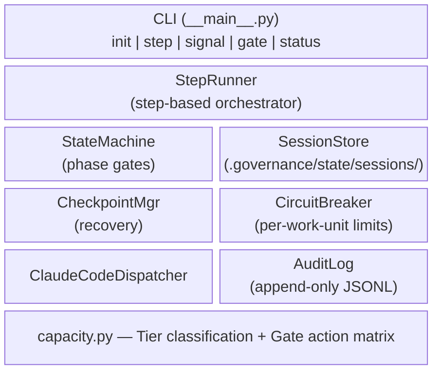
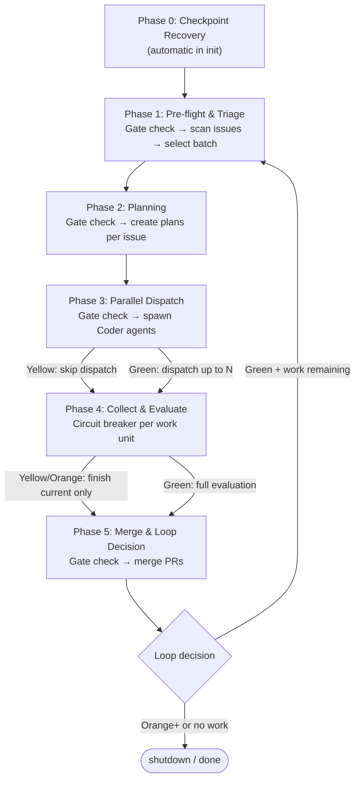

# Deterministic Orchestrator Architecture

## Overview

The deterministic orchestrator (`governance/engine/orchestrator/`) is a Python control plane that holds the program counter for the agentic governance loop. It replaces self-governing prompt chains with code-enforced phase transitions, capacity gates, and circuit breakers.

**Key inversion:** Code calls agent, not agent self-governing. Safety-critical decisions (when to stop, what to skip, when to checkpoint) are enforced by deterministic Python logic. Creative work (planning, coding, reviewing) stays with AI agents.

## Architecture

The orchestrator exposes a **CLI step function** the LLM queries between phases. State is persisted to disk between invocations, surviving context resets and process death.



### CLI Protocol

```bash
# Initialize or resume a session
python -m governance.engine.orchestrator init --config project.yaml

# Complete a phase and get next instruction
python -m governance.engine.orchestrator step --complete 1 --result '{"issues_selected": ["#42"]}'

# Report capacity signals
python -m governance.engine.orchestrator signal --type tool_call --count 5

# Read-only gate check
python -m governance.engine.orchestrator gate --phase 3

# Dump session state
python -m governance.engine.orchestrator status
```

All output is JSON to stdout. Exit code 2 on shutdown.

## Modules

| Module | Purpose | Lines |
|--------|---------|-------|
| `capacity.py` | Tier classification (Green/Yellow/Orange/Red), gate actions, thresholds | ~120 |
| `state_machine.py` | Phase transitions with gate enforcement, serialization (`to_dict`/`from_dict`) | ~100 |
| `step_result.py` | `StepResult` + `DispatchInstruction` — structured contract between CLI and LLM | ~80 |
| `session.py` | `SessionStore` + `PersistedSession` — session state on disk | ~90 |
| `step_runner.py` | Step-based orchestrator — `init_session()`, `step()`, `record_signal()`, `query_gate()` | ~350 |
| `claude_code_dispatcher.py` | Generates structured dispatch instructions for the LLM | ~90 |
| `__main__.py` | CLI entry point with argparse subcommands | ~170 |
| `checkpoint.py` | Write/load/validate/cleanup checkpoints, resume phase determination | ~110 |
| `circuit_breaker.py` | Per-work-unit eval cycle tracking (max 3 feedback, max 5 total) | ~65 |
| `audit.py` | Append-only JSONL event logging | ~50 |
| `dispatcher.py` | Abstract dispatch interface + `DryRunDispatcher` for testing | ~60 |
| `config.py` | Configuration loader from `project.yaml` | ~35 |
| `runner.py` | Legacy single-pass runner (preserved for backward compatibility) | ~130 |

## Capacity Model

### Four Tiers

| Tier | Tool Calls | Turns | Issues Completed (N=parallel_coders) |
|------|-----------|-------|--------------------------------------|
| Green | 0–49 | 0–59 | 0 to N-3 |
| Yellow | 50–64 | 60–99 | N-2 |
| Orange | 65–79 | 100–139 | N-1 |
| Red | 80+ | 140+ | N+ |

Additional Red triggers: `system_warning=True`, `degraded_recall=True`.

Highest tier across all signals wins. When `parallel_coders=-1` (unlimited mode), issue completion signal is disabled.

### Phase-Tier-Action Matrix

| Phase | Green | Yellow | Orange | Red |
|-------|-------|--------|--------|-----|
| 0 (Recovery) | proceed | proceed | emergency-stop | emergency-stop |
| 1 (Triage) | proceed | proceed | emergency-stop | emergency-stop |
| 2 (Planning) | proceed | proceed | emergency-stop | emergency-stop |
| 3 (Dispatch) | proceed | skip-dispatch | emergency-stop | emergency-stop |
| 4 (Collect) | proceed | finish-current | finish-current | emergency-stop |
| 5 (Merge) | proceed | proceed | emergency-stop | emergency-stop |

## Step-Based Loop

The LLM calls the CLI between each phase. State is persisted to `.governance/state/sessions/`.

```
LLM:  python -m governance.engine.orchestrator init
  →   {"action": "execute_phase", "phase": 1, ...}

LLM:  [does Phase 1 creative work]

LLM:  python -m governance.engine.orchestrator step --complete 1 --result '{"issues_selected": ["#42"]}'
  →   {"action": "execute_phase", "phase": 2, ...}

LLM:  [does Phase 2 planning work]

LLM:  python -m governance.engine.orchestrator step --complete 2 --result '{"plans": {...}}'
  →   {"action": "dispatch", "phase": 3, "tasks": [...]}

...repeat until "shutdown" or "done"
```

### Phase Loop



## Session Persistence

Sessions are persisted to `.governance/state/sessions/{session_id}.json` after every step. This is separate from checkpoints:

- **Sessions** — orchestrator internal state (every step); contains phase, signals, work state, state machine snapshot
- **Checkpoints** — user-facing recovery artifacts (phase transitions and shutdown); used for Phase 0 recovery

## Circuit Breaker

Per-work-unit limits prevent infinite evaluation loops:

- **Max 3 Tester FEEDBACK cycles** per work unit — after 3 rounds of Tester feedback, the unit is blocked
- **Max 5 total evaluation cycles** per work unit — including reassignments
- Blocked units are skipped in subsequent dispatch rounds
- Configurable via `max_feedback_cycles` and `max_total_eval_cycles` in config

## Auto-Clear Wrapper

`bin/auto-clear.sh` provides an outer loop that restarts sessions after context resets:

```bash
bash bin/auto-clear.sh                    # Default: 50 retries
bash bin/auto-clear.sh --max-retries 10   # Custom limit
```

The orchestrator persists state to disk, so each new session auto-resumes via `init`.

## Audit Trail

Every orchestrator event is logged as append-only JSONL:

- `session_init` — with resume phase
- `session_restored` — on resume from persisted session
- `checkpoint_recovery` — with found/not-found and details
- `gate_check` — phase, tier, action on every transition
- `dispatch` — agent count and correlation IDs
- `evaluation` — per work unit
- `circuit_breaker_blocked` — when a unit hits limits
- `shutdown` — tier and action that triggered it
- `session_done` — loop count and issues completed

## Testing

964+ tests across 11 test files:

- `test_capacity.py` — Tier classification, gate actions, boundary conditions, edge cases
- `test_state_machine.py` — Transitions, gate enforcement, signal recording, history, serialization round-trips
- `test_circuit_breaker.py` — Feedback limits, total limits, isolation, custom config
- `test_audit.py` — Event logging, JSONL format, directory creation
- `test_checkpoint_orchestrator.py` — Write/load, resume phase, issue validation, cleanup
- `test_runner.py` — Full lifecycle, Phase 0 recovery, gate enforcement, dispatch, Phase 5 decisions, audit
- `test_step_result.py` — StepResult serialization round-trips
- `test_session.py` — SessionStore save/load/list
- `test_claude_code_dispatcher.py` — Instruction generation, result recording
- `test_step_runner.py` — Init, step, loop, signals, persistence, shutdown, Phase 5 decisions
- `test_cli.py` — CLI integration tests via main()

Run tests:
```bash
PYTHONPATH=. python -m pytest governance/engine/tests/ -v --tb=short
```
