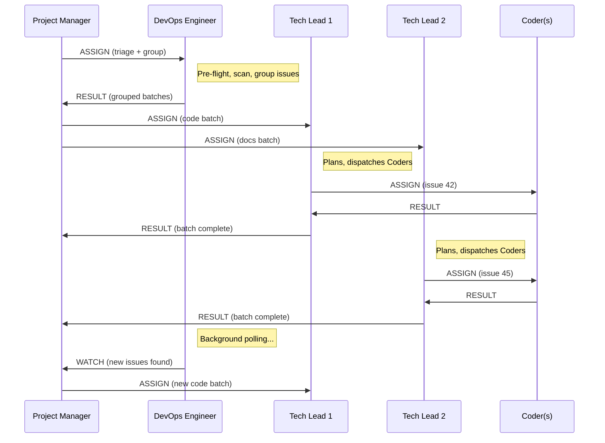

# Project Manager Architecture

## Overview

The Project Manager (PM) is an optional portfolio-level orchestrator that sits above the DevOps Engineer and Tech Lead in the Dark Forge agent hierarchy. It enables **multiplexed Tech Leads** — running multiple Tech Leads concurrently, each processing a batch of related issues — for higher throughput on repositories with many open issues.

## Activation

Set `governance.use_project_manager: true` in `project.yaml`. When absent or `false`, the standard pipeline operates unchanged.

```yaml
governance:
  use_project_manager: true
  parallel_tech_leads: 3    # max concurrent Tech Leads (default 3)
  parallel_coders: 6           # per Tech Lead (default 5)
```

## Agent Hierarchy

### Standard Mode (default)

```
DevOps Engineer (entry point)
  └── Tech Lead
        ├── Coder 1
        ├── Coder 2
        ├── ...
        ├── Coder N
        ├── IaC Engineer (conditional)
        └── Tester
```

### PM Mode (opt-in)

```
Project Manager (entry point)
  ├── DevOps Engineer (background — polling)
  ├── Tech Lead 1 (batch: code issues)
  │     ├── Coder 1.1
  │     ├── Coder 1.2
  │     └── Tester
  ├── Tech Lead 2 (batch: docs issues)
  │     ├── Coder 2.1
  │     └── Tester
  └── Tech Lead M (batch: infra issues)
        ├── IaC Engineer
        └── Tester
```

## Data Flow



## Issue Grouping

The DevOps Engineer groups issues by change type before returning them to the PM:

| Group Type | Detection Signals | Typical Work |
|-----------|-------------------|-------------|
| `code` | Labels: `bug`, `feature`, `enhancement` | Feature implementations, bug fixes |
| `docs` | Labels: `documentation` | Documentation updates |
| `infra` | Labels: `infrastructure`, `devops` | IaC changes, pipeline updates |
| `security` | Labels: `security`, `vulnerability` | Security fixes, policy updates |
| `mixed` | Multi-category or unclassifiable | Cross-cutting changes |

Rules:
- Each issue belongs to exactly one group
- Multi-category issues default to `mixed`
- Maximum 20 issues per group (split if exceeded)
- Single-issue groups are valid

## DevOps Engineer Auto-Spawn

When PM mode is active, the orchestrator automatically includes a DevOps Engineer background task in the Phase 1 step result. The LLM spawns this agent without manual intervention.

The DevOps Engineer is auto-spawned because Tech Leads are batch-scoped -- they create PRs and move on to the next issue. Without a dedicated agent monitoring PRs, they sit unmerged indefinitely.

### Responsibility Separation

| Responsibility | Standard Mode Owner | PM Mode Owner |
|---|---|---|
| Pre-flight checks | DevOps Engineer | DevOps Engineer (background) |
| Issue triage & grouping | DevOps Engineer | DevOps Engineer (background) |
| Implementation planning | Tech Lead | Tech Lead (batch-scoped) |
| Coder dispatch | Tech Lead | Tech Lead (batch-scoped) |
| Test Evaluator evaluation | Tech Lead | Tech Lead (batch-scoped) |
| PR creation | Tech Lead | Tech Lead (batch-scoped) |
| PR CI monitoring | Tech Lead | DevOps Engineer (background) |
| Governance panel execution | Tech Lead | DevOps Engineer (background) |
| Copilot recommendation review | Tech Lead | DevOps Engineer (background) |
| Pre-merge thread verification | Tech Lead | DevOps Engineer (background) |
| Merge execution | Tech Lead | DevOps Engineer (background) |
| Issue closing after merge | Tech Lead | DevOps Engineer (background) |
| Branch rebase on conflicts | Tech Lead | DevOps Engineer (background) |
| New issue polling | N/A | DevOps Engineer (background) |
| Session lifecycle | DevOps Engineer | Project Manager |

The DevOps Engineer runs a continuous operations loop defined in `governance/prompts/devops-operations-loop.md`.

## Background Polling

The DevOps Engineer runs in a continuous polling loop after the initial triage:

1. Poll every 2 minutes for new actionable issues
2. Apply standard filters (no existing branch, no blocking labels, etc.)
3. Deduplicate against previously reported issues
4. Group new issues and emit WATCH to PM
5. Continue until CANCEL received

## Context Management

### Nested Parallelism Budget

Total concurrent agents = M (Tech Leads) x N (Coders per CM) + 1 (DevOps background).

Example with defaults: 3 Tech Leads x 6 Coders = 18 Coders + 1 DevOps = 22 concurrent agents.

Each agent runs in its own context window via `Task` tool with worktree isolation, so the PM's main context is used only for coordination.

### Capacity Tiers for PM

The PM uses the standard four-tier capacity model with PM-specific signals:

| Tier | Action |
|------|--------|
| Green | Normal — spawn Tech Leads, process WATCH |
| Yellow | No new CM dispatches — wait for in-flight CMs |
| Orange | CANCEL all CMs, checkpoint, request /clear |
| Red | Emergency CANCEL, immediate checkpoint |

## CANCEL Propagation

```
Project Manager
  ├── CANCEL → DevOps Engineer (stops polling)
  ├── CANCEL → Tech Lead 1
  │     ├── CANCEL → Coder 1.1
  │     ├── CANCEL → Coder 1.2
  │     └── CANCEL → Test Evaluator
  └── CANCEL → Tech Lead 2
        ├── CANCEL → Coder 2.1
        └── CANCEL → Test Evaluator
```

CANCEL flows strictly downward. Each agent commits partial work and emits a partial RESULT before stopping.

## Checkpoint Schema

PM-mode checkpoints extend the standard schema with:

```json
{
  "project_manager_mode": true,
  "parallel_tech_leads": 3,
  "tech_leads": [
    {
      "id": "cm-1",
      "group_type": "code",
      "issues": ["#42", "#43"],
      "status": "completed|active|failed",
      "prs_merged": ["#100"],
      "current_phase": "Phase 4"
    }
  ],
  "watch_queue": [
    {
      "poll_timestamp": "ISO-8601",
      "groups": [{"group_type": "code", "issue_numbers": [50, 51]}]
    }
  ],
  "devops_polling_active": true
}
```

## Cross-Batch Dependencies

If two Tech Leads modify the same files:

1. The PM detects the conflict when collecting results
2. The later batch is held until the earlier one merges
3. The held CM is instructed to rebase and continue

This is advisory in the initial implementation — detected but not blocked.

## Failure Handling

| Failure | PM Action |
|---------|-----------|
| DevOps Engineer crashes | Single restart attempt, then escalate to human |
| Tech Lead crashes | Log failure, queue batch for next session, continue with others |
| Tech Lead times out | Emit CANCEL, wait for partial RESULT, queue remainder |
| All Tech Leads fail | Escalate to human with failure summary |
| WATCH messages accumulate | Queue overflow warning at 10+ queued, escalate at 20+ |

## Backward Compatibility

- PM mode is **opt-in** — `governance.use_project_manager` defaults to `false`
- Standard pipeline (Phases 0-5) is completely unchanged when PM is disabled
- Agent protocol additions (WATCH message, PM routes) are backward-compatible — they are only exercised when PM is active
- Existing `parallel_coders` setting continues to control per-CM Coder dispatch
- New `parallel_tech_leads` setting has no effect when PM is disabled

## Configuration Reference

| Key | Type | Default | Description |
|-----|------|---------|-------------|
| `governance.use_project_manager` | boolean | `false` | Enable PM-multiplexed pipeline |
| `governance.parallel_tech_leads` | integer | `3` | Max concurrent Tech Leads (PM mode only) |
| `governance.parallel_coders` | integer | `5` | Max concurrent Coders per Tech Lead |

## Related Files

- `governance/personas/agentic/project-manager.md` — PM persona definition
- `governance/personas/agentic/devops-engineer.md` — DevOps Engineer (background mode)
- `governance/personas/agentic/tech-lead.md` — Tech Lead (batch-scoped mode)
- `governance/prompts/agent-protocol.md` — Agent protocol (WATCH message type, PM routes)
- `governance/prompts/startup.md` — Startup phases (PM mode section)
- `governance/prompts/devops-operations-loop.md` — DevOps Engineer continuous operations loop
- `governance/prompts/startup-pm-mode.md` — Full PM pipeline reference
