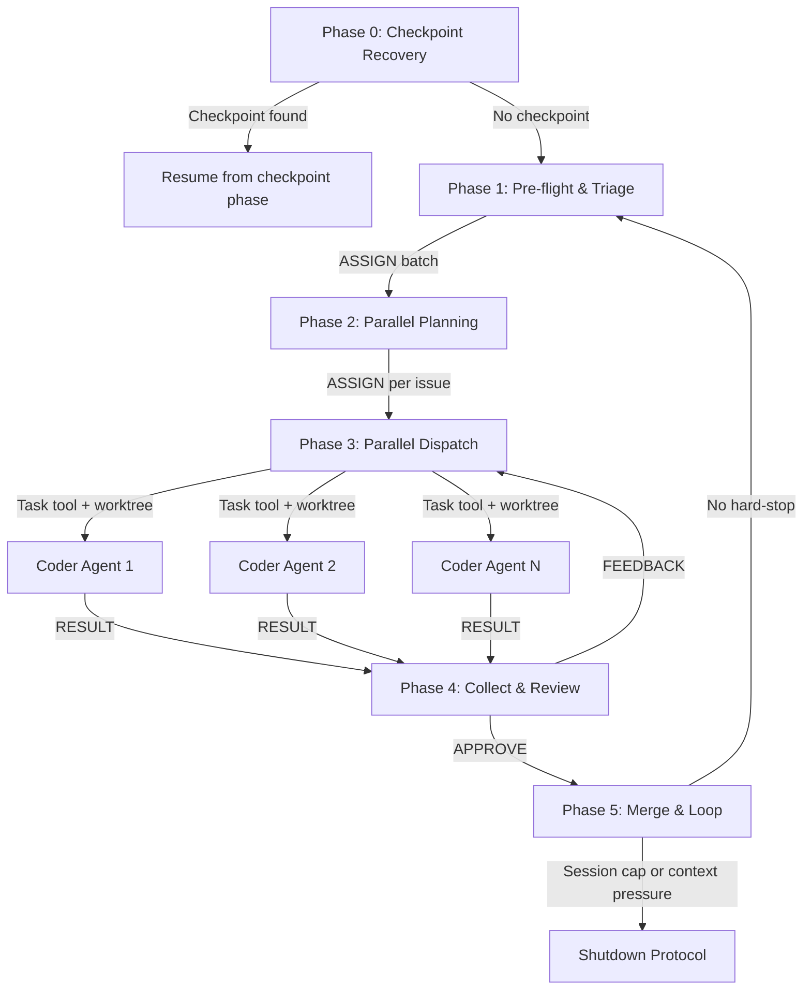

# Phase 0: Checkpoint Auto-Recovery

**Persona:** DevOps Engineer (`governance/personas/agentic/devops-engineer.md`)

> **Context Gate -- Phase 0 Entry:** Execute the Context Gate protocol from startup.md. This is the session entry point -- if already at Red tier on startup, execute Shutdown Protocol immediately.

## Pipeline Overview (Reference)



## Platform-Specific Gate Detection

**Claude Code:** Check the token counter visible in `--verbose` mode. System warnings about context limits are authoritative. Automatic summarization of earlier messages indicates Red tier.

**GitHub Copilot:** Check the context meter in the chat input area (hover for exact count). If operating programmatically, use `vscode.lm.countTokens()` on the assembled payload. Auto-summarization of conversation history indicates Red tier.

**Both platforms:** Track tool call count and chat turn count internally. These heuristics are always available regardless of platform. If platform-specific signals are unavailable, rely on heuristic signals alone.

## Enforcement: PreCompact Hook (Circuit Breaker)

If the agent fails to checkpoint before context reaches compaction, the PreCompact hook (`governance/bin/pre-compact-checkpoint.sh`) fires automatically. This is the last-resort circuit breaker:

1. The hook writes an emergency checkpoint to `.governance/checkpoints/`
2. If there are uncommitted changes, the hook auto-commits with `wip:` prefix
3. Compaction proceeds (instructions are preserved via Compact Instructions in CLAUDE.md)
4. After compaction, the agent reads Compact Instructions and reports the emergency to the user
5. User runs `/startup` -> Phase 0 auto-recovers from the emergency checkpoint

**The PreCompact hook is a safety net, not normal operation.** The context gate should prevent reaching compaction. If the hook fires, the agent's gate checks were insufficient.

---

This phase runs automatically at the start of every `/startup` invocation. After a context reset, the user must explicitly restart the agentic loop: in Claude Code, run `/clear` and then invoke `/startup` again; in GitHub Copilot, start a new thread and paste the startup directive. Phase 0 then auto-detects any existing checkpoint and resumes from it, so no additional manual reconstruction of state is needed.

### 0a: Scan for Checkpoints

Look for the most recent checkpoint file in `.governance/checkpoints/`:

```bash
ls -t .governance/checkpoints/*.json 2>/dev/null | head -1
```

- **If no checkpoint files exist**: skip Phase 0 entirely, proceed to Phase 1.
- **If a checkpoint file is found**: read it and proceed to 0b.
- **If the user provides a specific checkpoint path** (e.g., Copilot users pasting a path): prefer the user-specified path over auto-scanning.

### 0b: Validate Checkpoint Issues

For each issue listed in the checkpoint's `current_issue` and `issues_remaining` fields, verify it is still open:

```bash
gh issue view <number> --json state --jq '.state'
```

- Remove any **closed** issues from the work queue. Closed issues represent a user decision -- do not resume work on them.
- If `current_issue` is closed, set it to `null` and move to the next remaining issue.
- If all issues (both `current_issue` and `issues_remaining`) are closed, discard the checkpoint and proceed to Phase 1 for a fresh scan.

### 0c: Validate Git State

Verify the working tree matches the checkpoint's expected state:

```bash
git status --porcelain
git branch --show-current
```

- If the working tree is dirty, **do not auto-commit on resume**. Surface what is dirty (summarize `git status`), and prefer `git stash` to preserve changes safely. If stashing fails, warn and proceed to Phase 1 (fresh start).
- If the current branch does not match the checkpoint's `branch` field, surface the mismatch and check out the correct branch.
- If git state cannot be reconciled cleanly (merge conflicts, unknown branch, failed stash), warn, abort the resume, and proceed to Phase 1 (fresh start) once the working tree is confirmed clean.

### 0d: Resume from Checkpoint

Using the checkpoint's structured fields (`prs_remaining`, `prs_created`, `current_issue`, `issues_remaining`), determine which phase to resume from:

| Checkpoint State | Resume Action |
|---------------------------|---------------|
| No `prs_created`, has `issues_remaining` | Proceed to Phase 2 with the validated issue queue |
| Has `prs_created` but none merged, has plans | Proceed to Phase 3 with the validated issue queue and existing plans |
| Has `prs_created` with open PRs | Enter Phase 4 monitoring loop for those PRs |
| Has `prs_created` all ready to merge | Enter Phase 5 |
| No remaining work | Proceed to Phase 1 for a fresh scan |

The `current_step` field provides descriptive context but is not the primary decision input. Load only the context needed for the resume phase (per the JIT loading strategy in `docs/architecture/context-management.md`).

After determining the resume point, log the recovery:

```
Checkpoint recovered: {checkpoint_file}
  Issues completed: {issues_completed}
  Issues remaining: {validated_remaining_issues}
  Resuming from: {current_step}
```

Proceed directly to the identified phase. Do not re-execute earlier phases unless the checkpoint state indicates Phase 1.

### 0e: Platform-Specific Handoff

The checkpoint-to-resume handoff differs by platform:

| Platform | Reset Mechanism | Resume Mechanism |
|----------|----------------|-----------------|
| **Claude Code** | User runs `/clear` | User runs `/startup` -- Phase 0 auto-detects the checkpoint |
| **GitHub Copilot** | User starts a new chat thread | User pastes: "Resume from checkpoint: `.governance/checkpoints/{file}`" -- Phase 0 reads the referenced file |
| **CLI / Other** | User starts a new session | Agent reads `.governance/checkpoints/` on startup -- Phase 0 auto-detects |

The Shutdown Protocol (Phase 5c / end of startup.md) tells the user exactly what to do, including the platform-specific reset instruction.

### 0f: Generate Session ID and Agent Log File

Generate a unique session identifier for the agent audit log. This ID is used by all agents throughout the session to write persistent log entries (see `governance/prompts/agent-protocol.md` -- Persistent Logging).

1. **Generate session ID** in `YYYYMMDD-session-N` format, where N increments based on existing log files for today's date:

   ```bash
   TODAY=$(date +%Y%m%d)
   EXISTING=$(ls .governance/state/agent-log/${TODAY}-session-*.jsonl 2>/dev/null | wc -l | tr -d ' ')
   SESSION_ID="${TODAY}-session-$((EXISTING + 1))"
   ```

2. **Create the log directory and file:**

   ```bash
   mkdir -p .governance/state/agent-log
   touch ".governance/state/agent-log/${SESSION_ID}.jsonl"
   ```

3. **Carry the `SESSION_ID` forward** -- all subsequent phases reference this value when logging agent protocol messages. Pass it to dispatched Coder agents in their Task prompt so they can log to the same session file.
