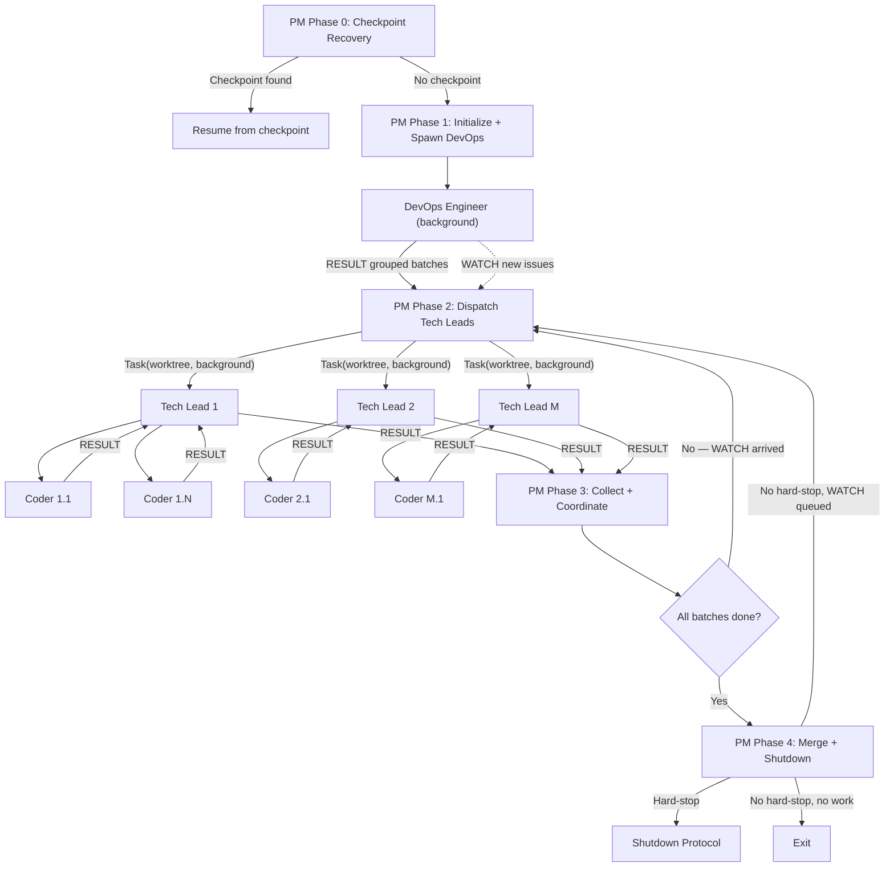

# Project Manager Mode (Opt-in)

**Activation:** Set `governance.use_project_manager: true` in `project.yaml`. When this flag is absent or `false`, the standard pipeline (Phases 0-5 in startup.md) operates unchanged.

When active, the Project Manager (`governance/personas/agentic/project-manager.md`) replaces the DevOps Engineer as the session entry point and introduces multiplexed Tech Leads for higher throughput. The standard phases are restructured as follows:

> See startup.md for the Context Gate protocol and Capacity Tiers definitions referenced throughout this file.

## PM Pipeline Overview



| PM Phase | Persona | Responsibility |
|----------|---------|---------------|
| 0 | Project Manager | Checkpoint recovery (same logic as standard Phase 0) |
| 1 | Project Manager + DevOps Engineer | PM initializes session, spawns DevOps Engineer as background agent for pre-flight and triage |
| 1b | DevOps Engineer (background) | Pre-flight checks, issue scanning, grouping by change type, RESULT to PM |
| 2 | Project Manager | Receives grouped batches, spawns M Tech Leads (one per group, M = `governance.parallel_tech_leads`, default 3) |
| 2b | Tech Leads (parallel) | Each CM plans its batch, dispatches its Coders (nested parallelism: PM -> CM -> Coder) |
| 3 | Project Manager | Collects Tech Lead RESULTs, coordinates cross-batch dependencies, processes WATCH messages |
| 4 | Project Manager | Merges all PRs (delegates to CMs), runs retrospective, handles DevOps background polling results |
| 4b | DevOps Engineer (background) | Continuous polling -- emits WATCH to PM when new actionable issues are discovered |

## PM Phase 0: Checkpoint Recovery

Identical to standard Phase 0. The Project Manager executes checkpoint scanning, validation, and session ID generation. If a PM-mode checkpoint is found (identified by the `project_manager_mode: true` field), resume with the PM-specific state (active Tech Leads, assigned batches, queued WATCH payloads).

## PM Phase 1: Initialize and Spawn DevOps Engineer

> **Context Gate -- PM Phase 1 Entry:** Execute the Context Gate protocol. Red tier on startup = execute Shutdown Protocol immediately.

**Persona:** Project Manager (`governance/personas/agentic/project-manager.md`)

1. **Read configuration:**
   ```yaml
   # project.yaml
   governance:
     use_project_manager: true
     parallel_tech_leads: 3    # default 3, max concurrent Tech Leads
     parallel_coders: 6           # per Tech Lead, default 5
   ```

2. **Spawn DevOps Engineer as background agent:**
   ```
   Task(
     subagent_type: "general-purpose",
     run_in_background: true,
     prompt: "<DevOps Engineer persona> + <pre-flight instructions> + <triage with grouping enabled>"
   )
   ```
   The DevOps Engineer runs pre-flight (submodule, repo config, branch protection), resolves open PRs, scans issues, and groups them by change type.

3. **Wait for DevOps Engineer RESULT** -- the DevOps Engineer returns a RESULT containing:
   - Pre-flight status report
   - Grouped issue batches (each group has a `group_type` and list of issues)
   - Resolved PR summary

## PM Phase 1b: DevOps Engineer Background Operations

**Persona:** DevOps Engineer (`governance/personas/agentic/devops-engineer.md`) -- operating in **background polling mode**

The DevOps Engineer executes the standard Phase 1 operations (pre-flight, resolve PRs, scan/filter/prioritize issues) with one addition: **issue grouping**.

### Issue Grouping

After filtering and prioritizing issues, the DevOps Engineer groups them by change type for efficient Tech Lead dispatch:

| Group Type | Detection Signals | Examples |
|-----------|-------------------|---------|
| `code` | Labels: `bug`, `feature`, `enhancement`; file patterns: `src/**`, `lib/**`, `app/**` | Feature implementations, bug fixes |
| `docs` | Labels: `documentation`; file patterns: `docs/**`, `*.md`, `README*` | Documentation updates, guide creation |
| `infra` | Labels: `infrastructure`, `devops`; file patterns: `*.bicep`, `*.tf`, `Dockerfile`, `.github/workflows/**` | IaC changes, pipeline updates |
| `security` | Labels: `security`, `vulnerability`; file patterns: `governance/policy/**`, `governance/schemas/**` | Security fixes, policy updates |
| `mixed` | Issues that span multiple categories or cannot be clearly classified | Cross-cutting changes |

**Grouping rules:**
1. Each issue belongs to exactly one group
2. If an issue matches multiple group types, classify as `mixed`
3. Groups with a single issue are valid (no minimum group size)
4. Maximum 20 issues per group (split into multiple groups of the same type if exceeded)

The DevOps Engineer emits a RESULT to the Project Manager with the full grouped batch.

### Background Polling Mode

After the initial triage RESULT, the DevOps Engineer enters a polling loop:

1. **Poll interval:** Check for new issues every 2 minutes (configurable)
2. **Scan for new actionable issues** -- same filters as standard Phase 1d
3. **Exclude already-assigned issues** -- do not re-report issues already sent in a previous RESULT or WATCH
4. **On new issues found:** Group them and emit a WATCH message to the Project Manager
5. **On no new issues:** Continue polling silently
6. **On CANCEL from Project Manager:** Stop polling, commit any pending state, exit

## PM Phase 2: Dispatch Tech Leads

> **Context Gate -- PM Phase 2 Entry:** Execute the Context Gate protocol. Yellow tier: do NOT spawn new Tech Leads. Orange/Red: execute Shutdown Protocol.

**Persona:** Project Manager (`governance/personas/agentic/project-manager.md`)

1. **Receive grouped issue batches** from DevOps Engineer RESULT
2. **Determine dispatch count:** min(number of groups, `governance.parallel_tech_leads`)
3. **Spawn Tech Leads** -- one per issue group, each as a background Task agent:

   ```
   Task(
     subagent_type: "general-purpose",
     isolation: "worktree",
     run_in_background: true,
     prompt: "<Tech Lead persona> + <assigned issue group> + <batch scope constraints>"
   )
   ```

   **The Tech Lead prompt must include:**
   - Full Tech Lead persona instructions
   - The assigned issue group (issue numbers, titles, bodies, acceptance criteria)
   - Batch scope: only process the assigned issues, do not scan for additional work
   - `parallel_coders` setting (for nested Coder dispatch within the batch)
   - Session ID for agent audit logging
   - Instructions to report RESULT to PM (not DevOps Engineer) when all issues in the batch are complete

4. **Track active Tech Leads:**
   ```json
   {
     "tech_leads": [
       {
         "id": "cm-1",
         "group_type": "code",
         "issues": [42, 43, 44],
         "status": "active",
         "dispatched_at": "ISO-8601"
       }
     ],
     "watch_queue": []
   }
   ```

## PM Phase 2b: Tech Lead Batch Execution

Each Tech Lead executes the standard Phase 2-5 pipeline within its batch scope:

1. **Phase 2 (Planning):** Validate intent and create plans for all issues in its batch
2. **Phase 3 (Dispatch):** Spawn Coders for its batch issues (up to `parallel_coders` per CM)
3. **Phase 4 (Review):** Collect Coder results, run Test Evaluator evaluation, security review, PR monitoring
4. **Phase 5 (Merge):** Merge all PRs in its batch

When all issues in the batch are complete, the Tech Lead emits a RESULT to the Project Manager with:
- Summary of all issues completed
- PR numbers created and merged
- Any escalations or failures
- Review cycle counts

## PM Phase 3: Collect Results and Coordinate

**Persona:** Project Manager (`governance/personas/agentic/project-manager.md`)

The Project Manager collects Tech Lead results as they arrive:

1. **Process completed batches** -- update the tracking registry, aggregate metrics
2. **Handle WATCH messages** -- if the DevOps Engineer sends a WATCH with new issues:
   - If a Tech Lead slot is available and context tier is Green: spawn a new Tech Lead
   - Otherwise: queue the WATCH payload
3. **Process queued WATCH payloads** -- when an active Tech Lead completes, check the queue and spawn a replacement if capacity permits
4. **Detect cross-batch conflicts** -- if two Tech Leads modify the same files, coordinate by holding the later batch until the earlier one merges

## PM Phase 4: Merge, Retrospective, and Loop

> **Context Gate -- PM Phase 4 Entry:** Execute the Context Gate protocol. Yellow: proceed but do not spawn new CMs. Orange/Red: execute Shutdown Protocol.

**Persona:** Project Manager (`governance/personas/agentic/project-manager.md`)

1. **Verify all active Tech Leads have completed** or handle failures:
   - Completed: process RESULT
   - Failed: log failure, queue batch for next session
   - Timed out: emit CANCEL, wait for partial RESULT, queue remainder
2. **Run session retrospective** -- aggregate metrics across all Tech Leads
3. **Check for queued WATCH work:**
   - If WATCH queue is non-empty and no hard-stop condition: return to PM Phase 2
   - If WATCH queue is empty and DevOps is still polling: wait for next WATCH or exit condition
4. **Evaluate exit conditions:**
   - All work complete + no queued WATCH + DevOps reports no new issues: emit CANCEL to DevOps, exit
   - Hard-stop condition: execute Shutdown Protocol
   - WATCH queue has items: return to PM Phase 2

## PM-Mode Constraints

All standard constraints (from startup.md) apply, plus:
- **Maximum M Tech Leads** (where M = `governance.parallel_tech_leads`, default 3) -- never exceed the configured cap
- **Nested parallelism budget:** Total concurrent agents = M Tech Leads x N Coders (per CM). Monitor aggregate context pressure.
- **DevOps Engineer is single-instance** -- only one DevOps Engineer runs at a time (background polling mode)
- **Tech Leads are batch-scoped** -- a Tech Lead processes only its assigned issues; it does not scan for additional work
- **WATCH messages are ordered** -- process in arrival order; do not skip or reorder
- **PM checkpoint includes CM state** -- when writing a checkpoint, include active Tech Lead IDs, their assigned batches, and the WATCH queue

## PM-Mode Checkpoint Schema Extension

When in PM mode, the checkpoint JSON includes additional fields:

```json
{
  "project_manager_mode": true,
  "parallel_tech_leads": 3,
  "tech_leads": [
    {
      "id": "cm-1",
      "group_type": "code",
      "issues": ["#42", "#43"],
      "status": "completed",
      "prs_merged": ["#100", "#101"]
    },
    {
      "id": "cm-2",
      "group_type": "docs",
      "issues": ["#45"],
      "status": "active",
      "current_phase": "Phase 4"
    }
  ],
  "watch_queue": [
    {
      "poll_timestamp": "ISO-8601",
      "groups": [{"group_type": "code", "issue_numbers": [50, 51]}]
    }
  ],
  "devops_polling_active": true
}
```
