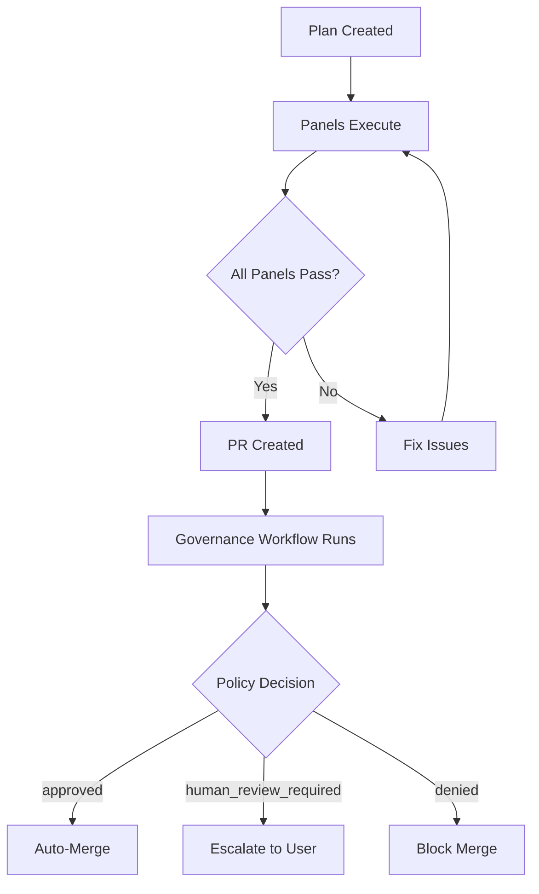
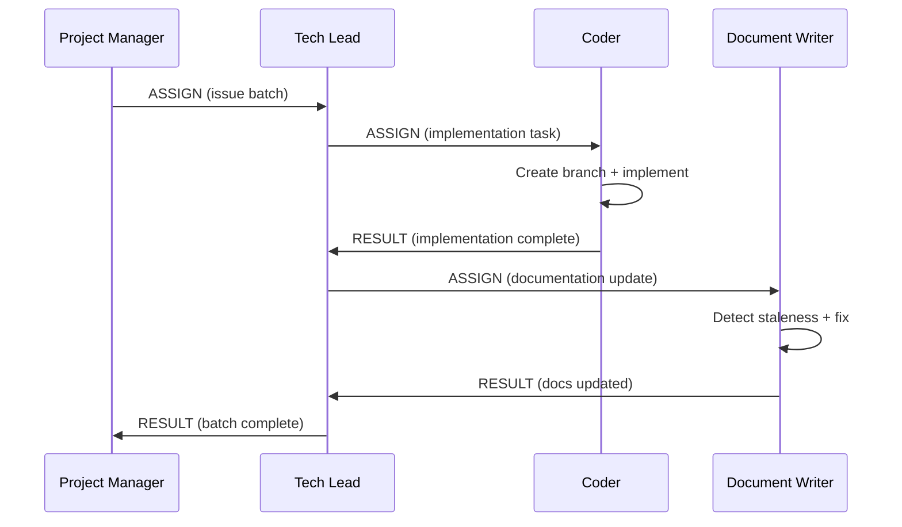
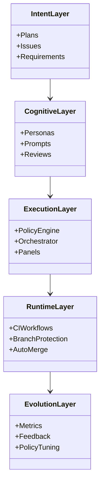
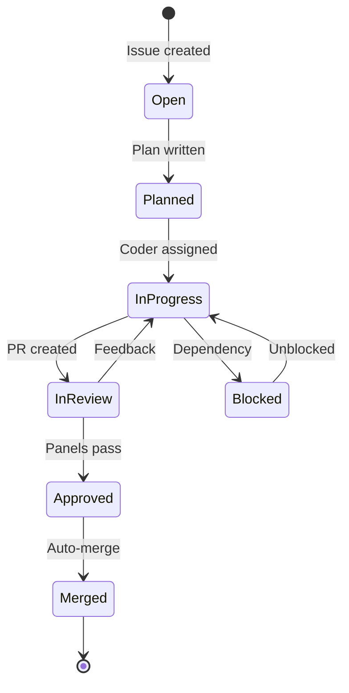
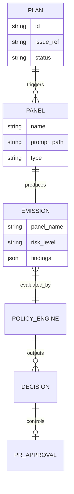
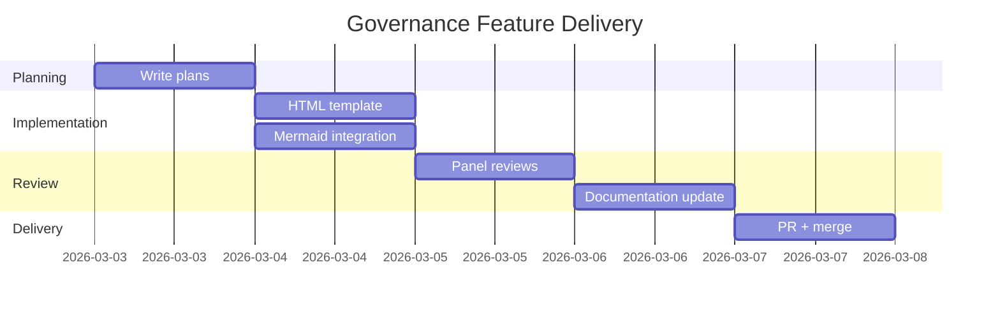

# Mermaid.js Integration Patterns for Governance Documentation

This example document demonstrates Mermaid.js diagram patterns commonly used in Dark Forge governance documentation. Use these as starting templates when creating architecture, flow, and relationship diagrams.

## Governance Pipeline Flow



## Agent Communication Sequence



## Governance Layer Architecture



## Issue Lifecycle State Diagram



## Panel Dependency Relationships



## Sprint Timeline



## Standalone HTML Usage

For self-contained HTML reports, include Mermaid via CDN:

```html
<!DOCTYPE html>
<html lang="en">
<head>
    <meta charset="utf-8">
    <meta name="viewport" content="width=device-width, initial-scale=1">
    <title>Governance Report</title>
</head>
<body>
    <h1>Architecture Overview</h1>

    <div class="mermaid" role="img" aria-label="System architecture showing three layers">
        flowchart LR
            A[Client] --> B[API Gateway]
            B --> C[Service Layer]
            C --> D[(Database)]
    </div>

    <script src="https://cdn.jsdelivr.net/npm/mermaid/dist/mermaid.min.js"></script>
    <script>mermaid.initialize({ startOnLoad: true });</script>
</body>
</html>
```

## Tips

- Keep diagrams focused -- one concept per diagram, not an entire system
- Use descriptive node labels, not abbreviations
- Add `aria-label` to every `<div class="mermaid">` container in HTML
- In Markdown, GitHub renders Mermaid natively -- no configuration needed
- For complex diagrams that exceed ~30 nodes, consider splitting into multiple diagrams
