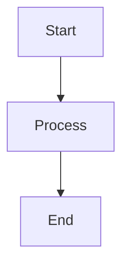

# HTML Instructions

Extends the base AI instructions with HTML-specific conventions.

## HTML5 Structure

- Always declare `<!DOCTYPE html>` as the first line
- Use semantic elements: `<header>`, `<nav>`, `<main>`, `<section>`, `<article>`, `<aside>`, `<footer>`
- Set `<html lang="en">` (or appropriate language code) for accessibility
- Include `<meta charset="utf-8">` and `<meta name="viewport" content="width=device-width, initial-scale=1">` in `<head>`
- Use `<template>` elements for client-side rendering patterns
- Keep `<script>` tags at the end of `<body>` or use `defer`/`async` attributes

## Semantic Markup

- Use heading hierarchy correctly: one `<h1>` per page, then `<h2>`, `<h3>` in order -- never skip levels
- Use `<button>` for actions, `<a>` for navigation -- never use `<div>` or `<span>` as interactive elements
- Use `<table>` only for tabular data, never for layout
- Use `<figure>` and `<figcaption>` for images, diagrams, and code examples
- Use `<details>` and `<summary>` for collapsible content
- Use `<time datetime="...">` for dates and times

## Mermaid.js Diagrams

Mermaid.js is the standard diagramming solution. All architecture, flow, sequence, and ER diagrams must use Mermaid -- never commit static images (PNG, SVG) for diagrams that can be expressed as text.

### CDN Inclusion (Standalone HTML)

```html
<!-- Place before closing </body> tag -->
<script src="https://cdn.jsdelivr.net/npm/mermaid/dist/mermaid.min.js"></script>
<script>mermaid.initialize({ startOnLoad: true });</script>
```

To pin a specific version:

```html
<script src="https://cdn.jsdelivr.net/npm/mermaid@11/dist/mermaid.min.js"></script>
```

### HTML Container Syntax

```html
<div class="mermaid" role="img" aria-label="Description of the diagram">
  flowchart TD
    A[Start] --> B[Process]
    B --> C[End]
</div>
```

### Markdown Fenced Block Syntax

In Markdown files (GitHub natively renders these):

````markdown

````

### Supported Diagram Types

Use the appropriate diagram type for each use case:

| Diagram Type | Use Case |
|-------------|----------|
| `flowchart` | Process flows, decision trees, system architecture |
| `sequenceDiagram` | API interactions, service-to-service communication |
| `classDiagram` | Domain models, class relationships |
| `stateDiagram-v2` | State machines, lifecycle management |
| `erDiagram` | Database schemas, entity relationships |
| `gantt` | Project timelines, sprint planning |
| `pie` | Distribution data, survey results |
| `gitGraph` | Branch strategies, release flows |
| `mindmap` | Feature brainstorming, concept mapping |
| `timeline` | Historical events, release history |

### Accessibility for Diagrams

- Always add `role="img"` and `aria-label` to Mermaid containers
- Provide a text description of the diagram for screen readers
- Use high-contrast themes when available (`mermaid.initialize({ theme: 'default' })`)
- Consider providing a text-based alternative below complex diagrams

### Docs Framework Integration

**MkDocs** (with `pymdownx.superfences`):

```yaml
# mkdocs.yml
markdown_extensions:
  - pymdownx.superfences:
      custom_fences:
        - name: mermaid
          class: mermaid
          format: !!python/name:pymdownx.superfences.fence_code_format
```

**Docusaurus** (built-in support via `@docusaurus/theme-mermaid`):

```js
// docusaurus.config.js
module.exports = {
  markdown: { mermaid: true },
  themes: ['@docusaurus/theme-mermaid'],
};
```

## CSS Conventions

- Use CSS custom properties (variables) for theming: `--color-primary`, `--spacing-md`
- Prefer `class` selectors over `id` selectors for styling
- Use BEM naming convention for custom classes: `block__element--modifier`
- Use `rem` for font sizes and spacing, `px` for borders and small fixed values
- Prefer `flexbox` and `grid` over floats and positioning hacks
- Use `prefers-color-scheme` media query for dark mode support
- Use `prefers-reduced-motion` to disable animations for accessibility

## JavaScript in HTML

- Use `<script type="module">` for modern JavaScript
- Avoid inline event handlers (`onclick="..."`) -- use `addEventListener`
- Use `const` and `let`, never `var`
- Use template literals for string interpolation
- Minimize global scope pollution -- use IIFE or modules

## Security

- Set Content Security Policy (CSP) headers or `<meta>` tags
- When using Mermaid CDN, include the domain in CSP `script-src`: `script-src 'self' cdn.jsdelivr.net`
- Use Subresource Integrity (SRI) hashes for CDN scripts when pinning versions
- Sanitize all dynamic content inserted via `innerHTML` -- prefer `textContent` or DOM APIs
- Never use `eval()` or `new Function()` with user input
- Set `X-Content-Type-Options: nosniff` and `X-Frame-Options` headers

## Performance

- Minify HTML, CSS, and JS for production
- Use `loading="lazy"` on images below the fold
- Inline critical CSS in `<head>`; defer non-critical CSS
- Use `<link rel="preload">` for critical resources
- Compress assets with gzip or brotli
- Set appropriate `Cache-Control` headers for static assets

## Accessibility

- Ensure all images have `alt` attributes (empty `alt=""` for decorative images)
- Ensure color contrast ratio meets WCAG 2.1 AA (4.5:1 for normal text, 3:1 for large text)
- All interactive elements must be keyboard accessible with visible focus indicators
- Use ARIA attributes only when semantic HTML is insufficient
- Test with screen readers (VoiceOver, NVDA) and keyboard-only navigation
- Include skip navigation links for keyboard users

## Common Pitfalls

- Forgetting `<!DOCTYPE html>` causes quirks mode rendering
- Missing `viewport` meta tag breaks responsive layout on mobile
- Using `<div>` soup instead of semantic elements hurts accessibility and SEO
- Inline styles override CSS specificity and make maintenance difficult
- Loading Mermaid CDN without CSP allowlisting causes script blocking
- Forgetting `aria-label` on Mermaid containers makes diagrams invisible to screen readers
- Using `http://` instead of `https://` for CDN resources triggers mixed content warnings

---

*Extends .ai/instructions.md with HTML-specific conventions.*
