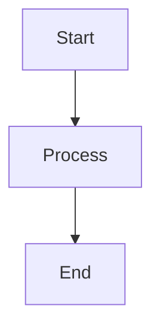

# Markdown / JSON Instructions

Extends the base AI instructions with Markdown and JSON-specific conventions.

## Markdown

- Use ATX-style headings (`#`, `##`, `###`) — not setext (underlines)
- One blank line before and after headings, code blocks, and lists
- Use fenced code blocks with language identifiers (` ```json `, ` ```bash `)
- Prefer reference-style links `[text][ref]` for repeated URLs; inline `[text](url)` for one-offs
- Use `<!-- comment -->` for authoring notes that should not render
- Tables: use consistent column alignment; prefer left-align unless numeric data
- Keep lines under 120 characters where practical; hard-wrap prose at sentence boundaries
- Front matter (YAML between `---` delimiters) for metadata when the toolchain supports it

## JSON

- 2-space indentation, no trailing commas (strict JSON)
- Use descriptive, camelCase keys for data; snake_case for config files matching YAML conventions
- Always include `$schema` reference in JSON Schema files
- Schema files use JSON Schema draft-07 or later (`"$schema": "https://json-schema.org/draft-07/schema#"`)
- Keep schemas composable: use `$ref` to reference shared definitions in `definitions/` or `$defs`
- Validate all JSON against its schema before committing (CI or pre-commit hook)
- For large JSON files (>500 lines), consider splitting into smaller composable files
- Use `additionalProperties: false` in schemas by default for strict validation

## JSON Schema Best Practices

- Define reusable types in a `definitions/` directory and `$ref` them
- Use `required` arrays explicitly — do not rely on implicit defaults
- Provide `description` on every property for self-documenting schemas
- Use `enum` for fixed sets, `pattern` for constrained strings
- Use `examples` array to document expected values
- Prefer `oneOf` / `anyOf` over complex conditional schemas when possible

## YAML (companion format)

- 2-space indentation, no tabs
- Use block scalars (`|` for literal, `>` for folded) for multi-line strings
- Quote strings that could be misinterpreted (e.g., `"true"`, `"null"`, `"3.0"`)
- Anchor/alias (`&`/`*`) for DRY within a single file; avoid cross-file references

## Documentation Structure

- `docs/` for narrative documentation (architecture, guides, onboarding)
- `schemas/` for JSON Schema definitions
- `config/` or project root for configuration files
- Use a `README.md` in each major directory to explain its purpose
- Index files (`index.md` or `README.md`) at each level of the doc tree

## Linting & Validation

- **markdownlint** (`markdownlint-cli2`) for Markdown style enforcement
- **ajv** or equivalent for JSON Schema validation in CI
- **prettier** for consistent JSON/Markdown formatting
- Pre-commit hooks: `markdownlint`, `prettier --check`, schema validation

## Diagrams

All diagrams in Markdown files must use Mermaid fenced blocks -- never commit static images for diagrams that can be expressed as text.

### Syntax

````markdown

````

GitHub renders ` ```mermaid ` blocks natively. No plugins or build steps required.

### Diagram Types and When to Use Them

| Diagram Type | When to Use |
|-------------|-------------|
| `flowchart` | Process flows, decision trees, architecture overviews |
| `sequenceDiagram` | API call sequences, service interactions, protocol flows |
| `classDiagram` | Domain models, interface hierarchies, type relationships |
| `stateDiagram-v2` | Lifecycle states, workflow transitions |
| `erDiagram` | Database schemas, entity relationships |
| `gantt` | Project timelines, milestone tracking |
| `pie` | Distribution breakdowns, survey results |
| `gitGraph` | Branch strategies, release flows |
| `mindmap` | Concept exploration, feature brainstorming |
| `timeline` | Release history, event sequences |

### Docs Site Integration

For **MkDocs** with `pymdownx.superfences`, configure a custom Mermaid fence:

```yaml
# mkdocs.yml
markdown_extensions:
  - pymdownx.superfences:
      custom_fences:
        - name: mermaid
          class: mermaid
          format: !!python/name:pymdownx.superfences.fence_code_format
```

For standalone HTML diagram pages, see `governance/templates/languages/html/instructions.md`.

## Common Pitfalls

- Forgetting to escape special Markdown characters in inline code or URLs
- Invalid JSON from trailing commas or unquoted keys (use a linter)
- Overly permissive JSON Schemas (`additionalProperties: true` by default)
- Inconsistent heading levels (skipping from `##` to `####`)
- Broken relative links after moving files — verify with a link checker
- YAML type coercion surprises: `yes`, `no`, `on`, `off` are booleans — quote them

---

*Extends .ai/instructions.md with Markdown and JSON-specific conventions.*
